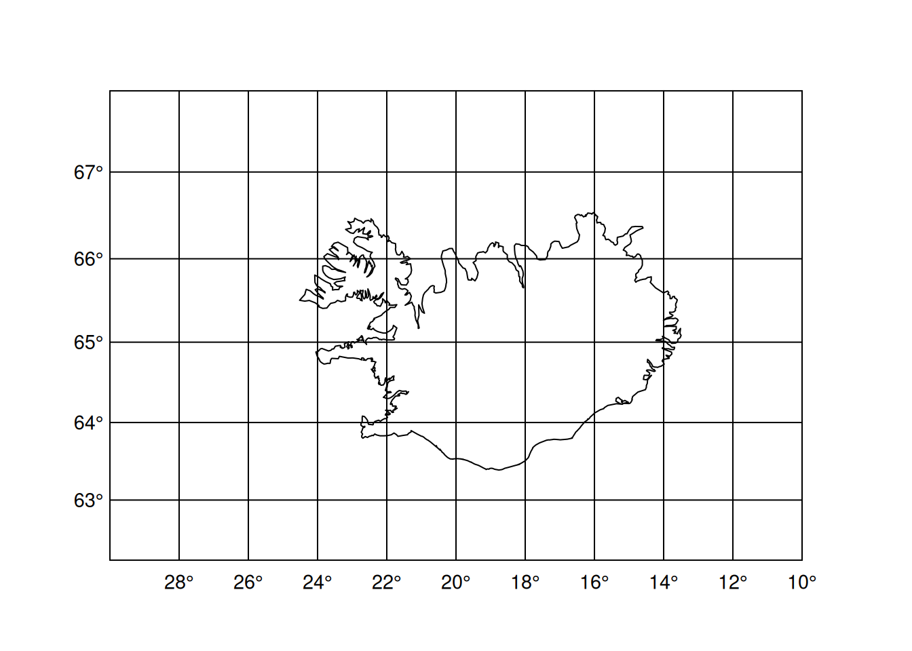
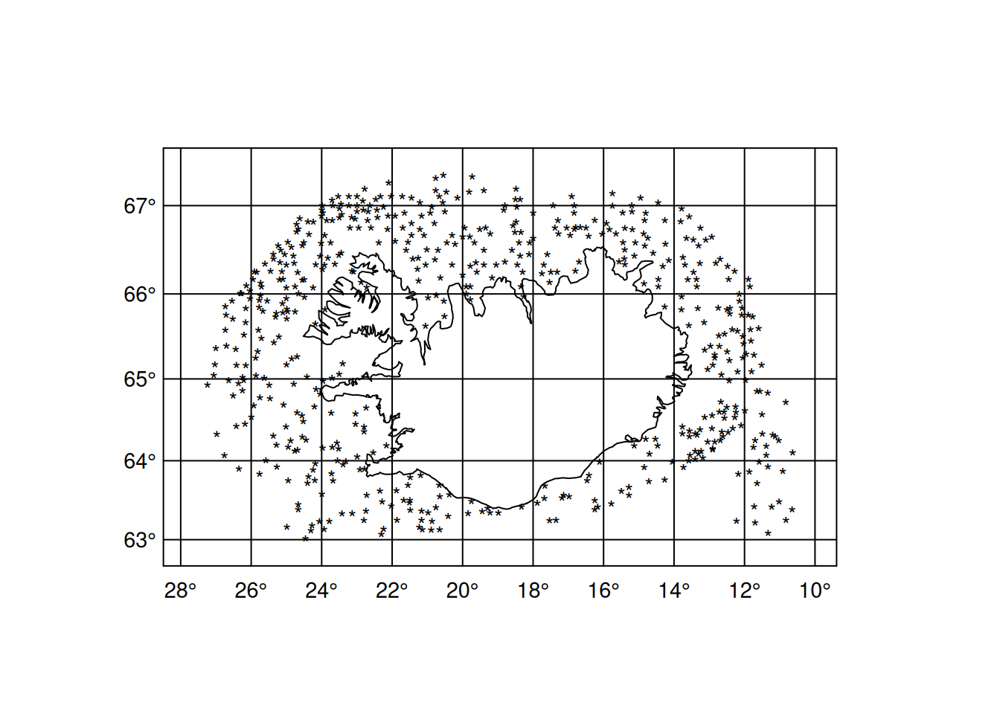

# Introduction

Package geo is a collection of useful utilities for mainly plotting marine data in the North Atlantic

To install, run:


::: {.cell}

```{.r .cell-code}
pak::pak("hafro/geo")
```
:::


## Example use

Simple plot of Iceland


::: {.cell}

```{.r .cell-code}
library(geo)
geoplot()
```

::: {.cell-output-display}
{width=672}
:::
:::


Let's add some data into the mix. Read the spring survey tow station locations from data.hafro.is:


::: {.cell}

```{.r .cell-code}
spring <- 
  read.csv("http://data.hafro.is/research/survey_stations/spring.csv")

head(spring)
```

::: {.cell-output .cell-output-stdout}
```
  Square Tow Subsq North1  West1 North2  West2 Depth1 Depth2 Sweeps Warp1 Warp2
1    310   1     1 632300 103900 632160 104750    430    438     45   525   460
2    310  11     3 631500 104950 631700 104100    399    412     45   470   450
3    311   1     2 632907 110122 633307 105986    333    344     45   435   420
4    311   2     1 632530 114370 632900 114070    392    408     45   545   540
5    311  11     3 631300 114200 631500 113400    421    428     45   515   510
6    311  12     4 630500 112000 630700 111300    447    454     45   520   510
  Warp3 Dir Length
1   590 250      4
2   490  40      4
3   450  20      4
4   550  20      4
5   520  60      4
6   530  70      4
```
:::
:::


Convert location data to decimal positions:


::: {.cell}

```{.r .cell-code}
spring <- 
  geoconvert(spring,col.names = c('North1','West1'))
spring <- 
  geoconvert(spring,col.names = c('North2','West2'))
```
:::


Now plot:


::: {.cell}

```{.r .cell-code}
geoplot(spring$North1,-spring$West1)
```

::: {.cell-output-display}
{width=672}
:::
:::
